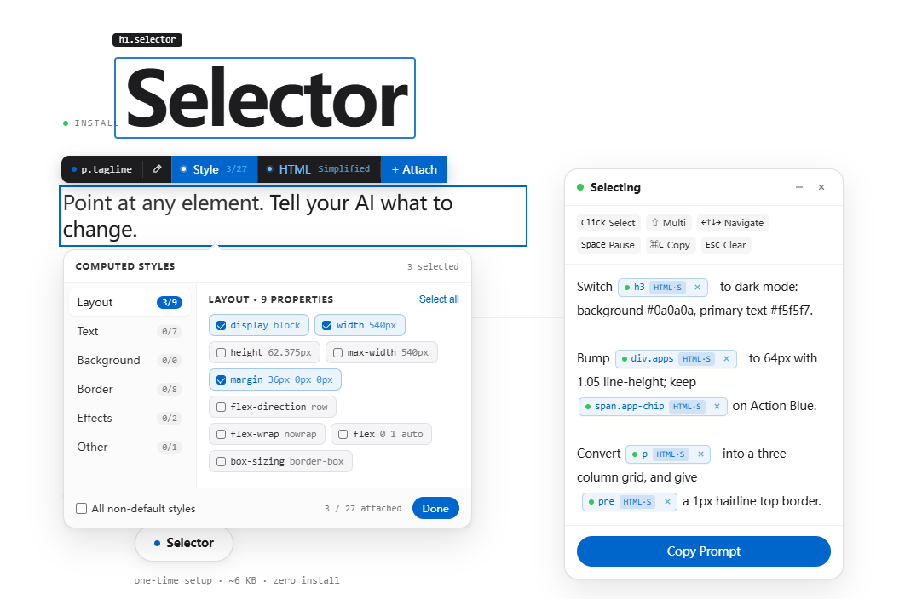
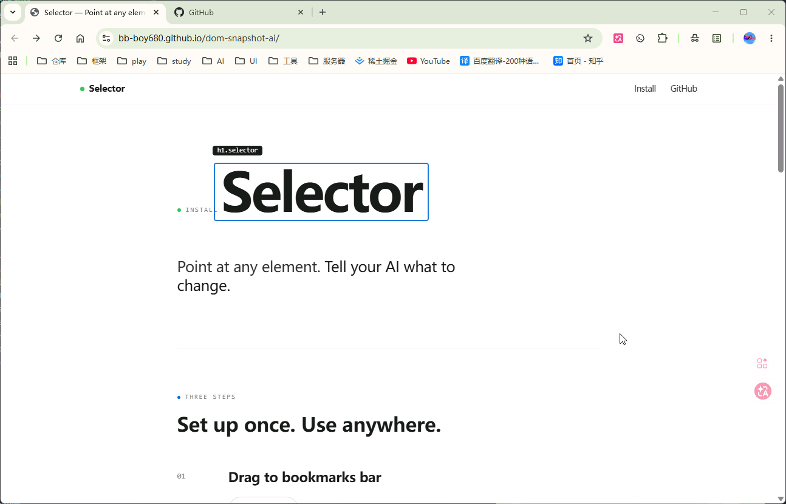
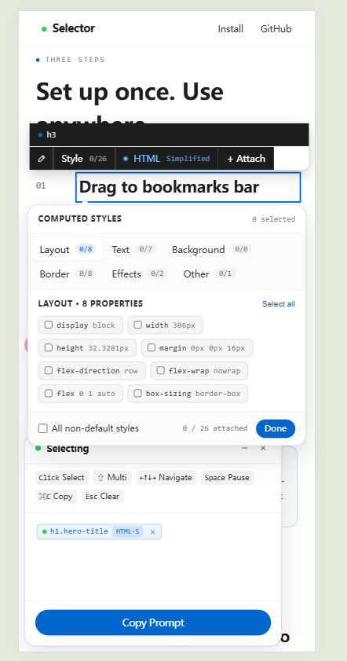

<div align="center">

# Selector

<sub>part of <a href="https://github.com/bb-boy680/dom-snapshot-ai"><code>dom-snapshot-ai</code></a></sub>

**Point at any element. Tell your AI what to change.**

A browser bookmarklet that lets you inspect any DOM element, capture its HTML and computed styles, attach modification requests, and export structured Markdown prompts for AI tools.

[](#output-example)
[](#features)
[](#features)
[](#output-example)
[](https://www.typescriptlang.org/)
[](https://bun.sh/)
[](https://bb-boy680.github.io/dom-snapshot-ai/)
[](#license)

[English](./README.md) · [中文](./docs/README.zh-CN.md)



</div>

---

## Why Selector?

Copying HTML snippets by hand is slow and error-prone. Selector automates the entire loop: **pick elements visually, annotate what you want changed, and paste a ready-to-use prompt into any AI assistant** — Claude Code, Codex, Cursor, ChatGPT, or any chat-based tool.

No extension store. No permissions. No server. One bookmarklet, any page.

## Demo



## Features

- **One-click install** — drag the bookmarklet to your bar, done (~15 KB gzip, zero dependencies)
- **Visual element selection** — hover to highlight, click to select, works on any webpage
- **Multi-select** — `Shift+Click` picks and auto-attaches additional elements into the same prompt
- **Computed styles capture** — filtered, grouped (layout / text / bg / border / effects), non-default only
- **HTML snapshots** — simplified (self only) or full (descendants with truncation)
- **Inline annotation** — write modification requests per element directly in the editor
- **Structured Markdown output** — selector path + styles + HTML + your notes, ready to paste
- **Component path detection** — auto-detects React / Vue / Angular component hierarchy (e.g. `App › Layout › Card`) and source file locations in dev mode
- **Same-origin iframe support** — hover, select, and navigate elements inside same-origin iframes; the selector path is self-describing across frame boundaries (e.g. `body > iframe[https://...] > body > div.card`)
- **Keyboard-first workflow** — arrow keys for DOM navigation, `⌘C` / `Alt+C` to copy, `Space` to pause, `Esc` to clear
- **Shadow DOM isolation** — UI lives in an open Shadow DOM; no CSS/JS conflicts with the host page
- **Mobile-friendly** — touch-optimized floating UI with adaptive positioning
- **Self-hosted** — single IIFE, deploy `selector.js` anywhere (GitHub Pages, CDN, your own server)

## Install

1. Open the [Selector landing page](https://bb-boy680.github.io/dom-snapshot-ai/)
2. Drag the **Selector** button into your browser's bookmarks bar

That's it. Click the bookmark on any page to activate.

> [!TIP]
> The bookmarklet works on `localhost`, staging URLs, and any production site — React, Next.js, Vue, Svelte, or plain HTML. No browser extension needed.

## Usage

### Basic workflow

1. **Activate** — click the Selector bookmark on any page
2. **Select** — hover to highlight elements, click to pick one
3. **Attach** — click the toolbar's "+ Attach" button to commit the element as a chip in the editor
4. **Annotate** — type your modification request next to the chip (e.g. "Make the background red")
5. **Copy** — press `⌘C` (macOS) or `Alt+C` (Windows) to copy the structured prompt
6. **Paste** — into your AI assistant of choice

### Quick reference

| Action | Shortcut |
|---|---|
| Select element | `Click` |
| Multi-select + Auto-attach | `Shift + Click` |
| Navigate DOM tree | `←` `↑` `↓` `→` |
| Pause / Resume hover | `Space` |
| Copy prompt | `⌘ C` / `Alt + C` |
| Clear all / Exit | `Esc` |

### Output example

The copied prompt looks like this:

````markdown
# Element: <div class="product-card">
- **URL**: /shop/accessories

- **selector**: body > main > section > div.product-card
- **componentPath**: App › MainLayout › ProductSection › ProductCard
- **source**: src/components/ProductCard.tsx:24

- **Modification Request**:
```text
Make the background red.
```

- **Computed Styles**:
```css
display: inline-flex;
padding: 8px 16px;
font-size: 14px;
color: #fff;
background-color: #007bff;
border-radius: 4px;
```

- **HTML (full)**:
```html
<div class="product-card">
  <h3>AirPods Pro</h3>
  <p class="price">From $269 · 3 colors</p>
  <span class="target-btn">Learn more</span>
</div>
```
````

## Architecture

Selector is a single IIFE with CSS inlined via esbuild. It mounts a `#__dom_snapshot_ai_root__` host element on `document.documentElement` (`<html>`) with an open Shadow DOM — all UI lives inside it, fully isolated from the host page.

```
src/
├── index.ts            # Entry point — mount, wire modules, teardown
├── styles.css          # All styles (inlined at build time)
├── types.d.ts          # TypeScript declarations
├── core/
│   ├── store.ts        # Central state + pub/sub + event bus
│   ├── interact.ts     # Page-level event capture (hover/click/keyboard)
│   ├── markdown.ts     # Markdown prompt generation
│   ├── html-snapshot.ts    # HTML capture (simplified / full)
│   ├── style-groups.ts     # Computed style collection & grouping
│   ├── selector-path.ts    # CSS selector generation (cross-iframe aware)
│   ├── component-path.ts   # Framework component path + source detection
│   └── iframe-manager.ts   # Same-origin iframe binding (events, outlines, MutationObserver)
└── ui/
    ├── toolbar.ts      # Floating toolbar + popcards (Edit/Style/HTML)
    ├── panel.ts        # Prompt editor panel (contenteditable + chips)
    └── draggable.ts    # Panel/dock drag with viewport clamping
```

Key design decisions:

- **Vanilla TypeScript, no framework** — minimizes footprint when injected into arbitrary host pages
- **Shadow DOM isolation** — prevents CSS/JS conflicts; events use `composedPath()` to distinguish panel clicks from page clicks
- **Two-stage selection** — click creates an uncommitted preview; "Attach" commits it as an editor chip
- **RAF-scheduled renders** — toolbar repositions on scroll/resize via `requestAnimationFrame` to avoid flicker

## Development

Prerequisites: [Bun](https://bun.sh/) >= 1.0

```bash
# Install dependencies
bun install

# Start dev build with watch mode
bun run dev

# Production build (minified)
bun run build

# Type checking
bun run typecheck

# Lint
bun run lint

# Run tests
bun test

# Full check (typecheck + lint + test)
bun run check
```

> [!NOTE]
> The dev server is just esbuild watch mode — it rebuilds `dist/selector.js` on source changes. Open `dist/index.html` via VSCode Live Server (`http://127.0.0.1:5500/dist/index.html`) and refresh after edits. Do NOT run `bun run dev` automatically — start it yourself.

### Local preview

1. Run `bun run dev`
2. Open `dist/index.html` via VSCode Live Server
3. Drag the "Selector" link from the page into your bookmarks bar
4. Navigate to any page and click the bookmark

### Custom deployment

For production, `selector.js` must be reachable from arbitrary host pages (the bookmarklet captures the URL at build time):

```bash
SELECTOR_URL=https://bb-boy680.github.io/dom-snapshot-ai/selector.js bun run build
```

## Mobile



Selector's floating UI adapts to touch devices with:
- 44×44px minimum touch targets
- Adaptive toolbar positioning (above/below/side)
- Side-snapping collapsed dock with swipe-to-expand
- Viewport-clamped popcards

## License

MIT
